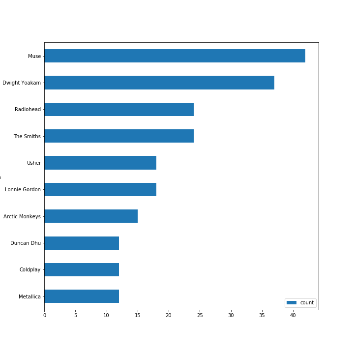

# Sparkfy Data Warehouse

## 1.0 Introduction

In this project we are trying to build cloud based analysis database for sparkfy from their data which stored in JSON format in S3 buckets.
the data is about their user logs and songs used in their app.

this project is aimed to build ETL pipeline, extract the data from the buckets, staging them into redshift and finally transform the data into relational database.
as a test a dashboard will be created from the database

## 2.0 ETL Pipeline

the ETL Pipeline can be summriezed in the following image

  
<b>Image1:  ETL process</B>

  

  This graph shows the whole ETL process starting from log data and song data to the staging area then to the relational data base.
  

## 3.0 Data files

Data files are stored as JSON files in two main online directories the first on is log data  which present the songs played by users and it has several attributes shown in a following table the second directory is for song data which has all songs in Sparkify Database the list of attributes contained in shown below

<b>Log data attributes</b> 

<table border="1" class="dataframe">  <tbody>    <tr>      <td>artist</td>    </tr>    <tr>      <td>auth</td>    </tr>    <tr>      <td>firstname</td>    </tr>    <tr>      <td>gender</td>    </tr>    <tr>      <td>itemInSession</td>    </tr>    <tr>      <td>lastName</td>    </tr>    <tr>      <td>length</td>    </tr>    <tr>      <td>level</td>    </tr>    <tr>      <td>location</td>    </tr>    <tr>      <td>method</td>    </tr>    <tr>      <td>page</td>    </tr>    <tr>      <td>registration</td>    </tr>    <tr>      <td>sessionId</td>    </tr>    <tr>      <td>song</td>    </tr>    <tr>      <td>status</td>    </tr>    <tr>      <td>ts</td>    </tr>    <tr>      <td>userAgent</td>    </tr>    <tr>      <td>userId</td>    </tr>  </tbody></table>

<b>Songs data attributes</b> 

<table border="1" class="dataframe">  <tbody>    <tr>      <td>num_songs</td>    </tr>    <tr>      <td>artist_id</td>    </tr>    <tr>      <td>artist_latitude</td>    </tr>    <tr>      <td>artist_longitude</td>    </tr>    <tr>      <td>artist_location</td>    </tr>    <tr>      <td>artist_name</td>    </tr>    <tr>      <td>song_id</td>    </tr>    <tr>      <td>title</td>    </tr>    <tr>      <td>duration</td>    </tr>    <tr>      <td>year</td>    </tr>  </tbody></table>

## 4.0 Staging area

In the staging area we copy the data from S3 buckets into a tables to simplify extraction for the und users and feeding the relational database it allows to join tables in the same server or with minimal traffic. data cleansing took apart in this stage as filtering unwanted records but in this project filtering page = "NextSong" were done in a latter stage.
the tables included in this stage are

<b>staging_events_table</b> 

<table border="1" class="dataframe">  <tbody>    <tr>      <td>artist</td>    </tr>    <tr>      <td>auth</td>    </tr>    <tr>      <td>firstname</td>    </tr>    <tr>      <td>gender</td>    </tr>    <tr>      <td>itemInSession</td>    </tr>    <tr>      <td>lastName</td>    </tr>    <tr>      <td>length</td>    </tr>    <tr>      <td>level</td>    </tr>    <tr>      <td>location</td>    </tr>    <tr>      <td>method</td>    </tr>    <tr>      <td>page</td>    </tr>    <tr>      <td>registration</td>    </tr>    <tr>      <td>sessionId</td>    </tr>    <tr>      <td>song</td>    </tr>    <tr>      <td>status</td>    </tr>    <tr>      <td>ts</td>    </tr>    <tr>      <td>userAgent</td>    </tr>    <tr>      <td>userId</td>    </tr>  </tbody></table>

<b>staging_songs_table</b> 

<table border="1" class="dataframe">  <tbody>    <tr>      <td>num_songs</td>    </tr>    <tr>      <td>artist_id</td>    </tr>    <tr>      <td>artist_latitude</td>    </tr>    <tr>      <td>artist_longitude</td>    </tr>    <tr>      <td>artist_location</td>    </tr>    <tr>      <td>artist_name</td>    </tr>    <tr>      <td>song_id</td>    </tr>    <tr>      <td>title</td>    </tr>    <tr>      <td>duration</td>    </tr>    <tr>      <td>year</td>    </tr>  </tbody></table>

## 5.0  Relational Database

Star schema was used to model the database it's not the best way to model the Sparkify database in terms of storage but it's not much worst than the 3 normal form the only details about all tables in this stage are sown below

<b>Songplay Table (Fact Table)</b> 

<table border="1" class="dataframe">  <thead>    <tr style="text-align: Right;">      <th><b>Col</b></th>      <th><b>D_type</b></th>    </tr>  </thead>  <tbody>    <tr>      <td>songplay_id</td>      <td>int</td>    </tr>    <tr>      <td>start_time</td>      <td>timestamp</td>    </tr>    <tr>      <td>user_id</td>      <td>int</td>    </tr>    <tr>      <td>level</td>      <td>Varchar</td>    </tr>    <tr>      <td>song_id</td>      <td>Varchar</td>    </tr>    <tr>      <td>artist_id</td>      <td>Varchar</td>    </tr>    <tr>      <td>session_id</td>      <td>int</td>    </tr>    <tr>      <td>location</td>      <td>varchar</td>    </tr>    <tr>      <td>user_agent</td>      <td>varchar</td>    </tr>  </tbody></table>

<b>Users table</b> 

<table border="1" class="dataframe">  <thead>    <tr style="text-align: right;">      <th><b>Col</b></th>      <th><b>D_type</b></th>    </tr>  </thead>  <tbody>    <tr>      <td>userid</td>      <td>int</td>    </tr>    <tr>      <td>firstname</td>      <td>Varchar</td>    </tr>    <tr>      <td>lastname</td>      <td>Varchar</td>    </tr>    <tr>      <td>gender</td>      <td>char(1)</td>    </tr>    <tr>      <td>level</td>      <td>Varchar</td>    </tr>  </tbody></table>

<b>Songs table</b> 

<table border="1" class="dataframe">  <thead>    <tr style="text-align: right;">      <th><b>Col</b></th>      <th><b>D_type</b></th>    </tr>  </thead>  <tbody>    <tr>      <td>song_id</td>      <td>Varchar</td>    </tr>    <tr>      <td>title</td>      <td>Varchar</td>    </tr>    <tr>      <td>artist_id</td>      <td>Varchar</td>    </tr>    <tr>      <td>duration</td>      <td>numeric</td>    </tr>    <tr>      <td>year</td>      <td>int)</td>    </tr>  </tbody></table>

<b>Artists table</b> 

<table border="1" class="dataframe">  <thead>    <tr style="text-align: right;">      <th><b>Col</b></th>      <th><b>D_type</b></th>    </tr>  </thead>  <tbody>    <tr>      <td>artist_id</td>      <td>Varchar</td>    </tr>    <tr>      <td>artist_name</td>      <td>Varchar</td>    </tr>    <tr>      <td>artist_location</td>      <td>Varchar</td>    </tr>    <tr>      <td>artist_latitude</td>      <td>numeric</td>    </tr>    <tr>      <td>artist_longitude</td>      <td>numeric</td>    </tr>  </tbody></table>

<b>Time table</b> 

<table border="1" class="dataframe">  <thead>    <tr style="text-align: right;">      <th><b>Col</b></th>      <th><b>D_type</b></th>    </tr>  </thead>  <tbody>    <tr>      <td>start_time</td>      <td>timestamp</td>    </tr>    <tr>      <td>hour</td>      <td>int</td>    </tr>    <tr>      <td>day</td>      <td>int</td>    </tr>    <tr>      <td>week</td>      <td>int</td>    </tr>    <tr>      <td>month</td>      <td>int</td>    </tr>    <tr>      <td>year</td>      <td>int</td>    </tr>    <tr>      <td>weekday</td>      <td>int</td>    </tr>  </tbody></table>

## 6.0 Analysis

As a part of this project we need to validate the database by running analysis on extracted data from the data base. 2 graphs was generated by sql queries are shown below

<b>listining time during day</b> 

<pre>

query = """Select t.hour, count(sp.songplay_id) as song_listened
from
songplay sp
left join time t
on sp.start_time = t.start_time
group by 1
order by 1"""

pd.read_sql_query(query,conn).set_index("hour").plot(figsize=(20  ,8));          

</pre>

<b>Top 10 artisits</b> 

<pre>

query = """Select  a.artist_name, count(session_id)
from
songplay sp
join
artists a
on sp.artist_id = a.artist_id
group by 1
limit 10
"""

ax = pd.read_sql_query(query,conn).sort_values("count" ,ascending=False).plot(y ="count", x ="artist_name" , kind = "barh", figsize= (10,10))
ax.invert_yaxis()

</pre>

